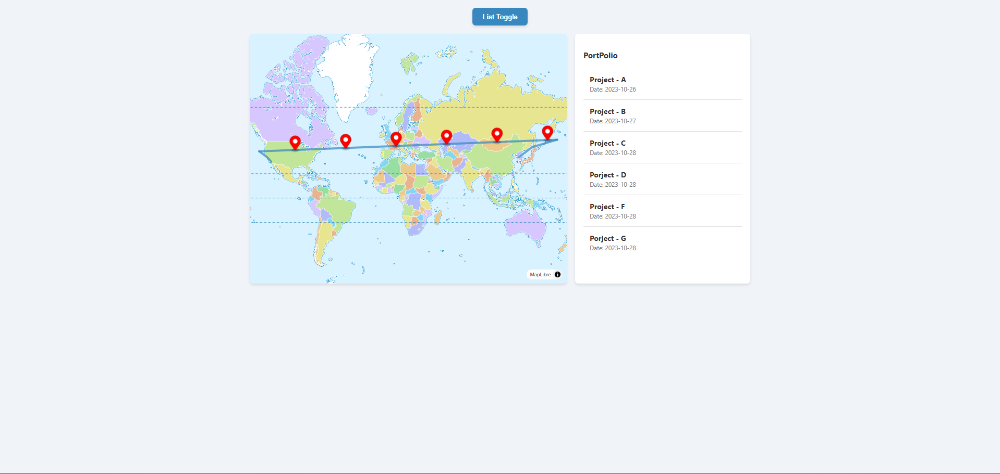

# GeoPort 🗺️

**GeoPort** is a geospatial JavaScript helper library that allows you to visually explore an individual's career path and experiences on a map.

## ✨ OverView

## ✨ Features

- **Point Interpolation**: Precisely calculate a point on a linestring at a given ratio, perfect for dynamic marker placement.

## 🚀 Next Steps
- **Path-based Portfolio**: Visualize a professional journey as an interactive route on a map.
- **Intuitive UI**: Display event details in a popup when hovering over a specific location on the map.
- **Lightweight & Framework Agnostic**: Designed to work seamlessly with popular map libraries like MapLibre GL JS and Mapbox GL JS without heavy dependencies.

---

## 🚀 Getting Started